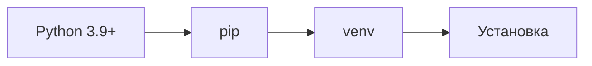
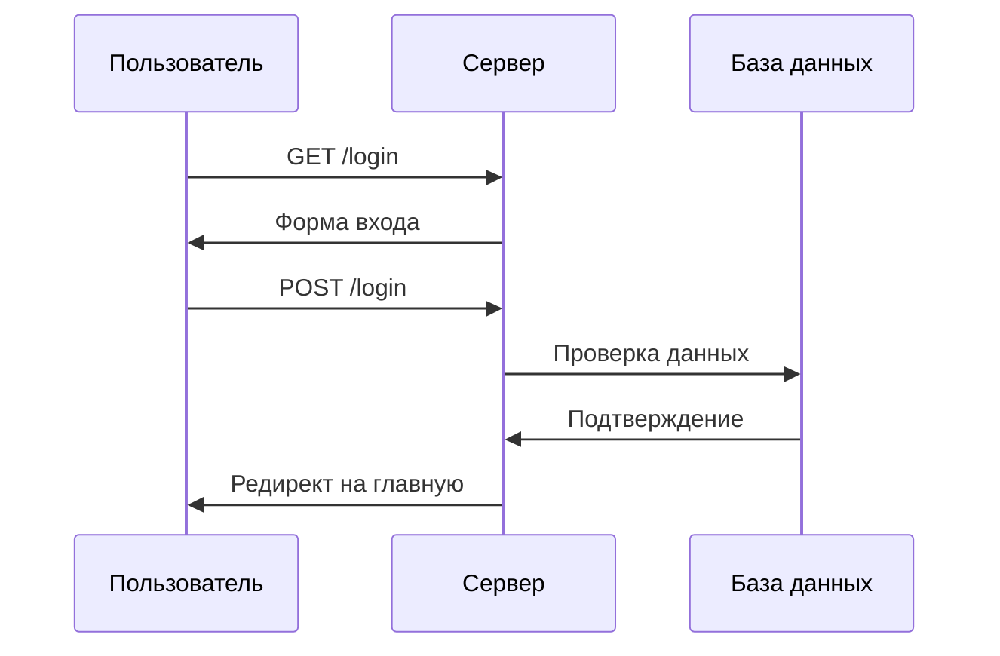

<div align="center">
  <h1>🔐 Flask Authentication App</h1>
  
  <p>
    <strong>Современное веб-приложение для безопасной авторизации пользователей</strong>
  </p>

  <p>
    <a href="#installation">
      
    </a>
    <a href="#license">
      
    </a>
    <a href="#testing">
      
    </a>
    
  </p>
</div>

---

<p align="center">
  
</p>

## 📚 Содержание

- [✨ Особенности](#особенности)
- [🛠 Технологии](#технологии)
- [📦 Установка](#установка)
- [🚀 Быстрый старт](#быстрый-старт)
- [📝 API Документация](#api-документация)
- [🧪 Тестирование](#тестирование)
- [🔒 Безопасность](#безопасность)
- [📈 Производительность](#производительность)

## ✨ Особенности

<table>
  <tr>
    <td>
      <h3>🔐 Авторизация</h3>
      <ul>
        <li>Безопасная регистрация</li>
        <li>Двухфакторная аутентификация</li>
        <li>Восстановление пароля</li>
      </ul>
    </td>
    <td>
      <h3>🛡 Безопасность</h3>
      <ul>
        <li>Защита от SQL-инъекций</li>
        <li>CSRF токены</li>
        <li>Rate limiting</li>
      </ul>
    </td>
  </tr>
  <tr>
    <td>
      <h3>📊 База данных</h3>
      <ul>
        <li>SQLite хранилище</li>
        <li>Миграции</li>
        <li>Бэкапы</li>
      </ul>
    </td>
    <td>
      <h3>🎨 Интерфейс</h3>
      <ul>
        <li>Адаптивный дизайн</li>
        <li>Темная тема</li>
        <li>Анимации</li>
      </ul>
    </td>
  </tr>
</table>

## 🛠 Технологии

<table>
  <tr>
    <td align="center" width="96">
      
      <br>Python
    </td>
    <td align="center" width="96">
      
      <br>Flask
    </td>
    <td align="center" width="96">
      
      <br>SQLite
    </td>
    <td align="center" width="96">
      
      <br>HTML
    </td>
    <td align="center" width="96">
      
      <br>CSS
    </td>
  </tr>
</table>

## 📦 Установка

### Предварительные требования



### Пошаговая инструкция

<details>
<summary>1. Клонирование репозитория</summary>

```bash
git clone [ссылка-на-репозиторий]
cd [директория-проекта]
```
</details>

<details>
<summary>2. Настройка окружения</summary>

```bash
# Linux/MacOS
python -m venv venv
source venv/bin/activate

# Windows
python -m venv venv
venv\Scripts\activate
```
</details>

<details>
<summary>3. Установка зависимостей</summary>

```bash
pip install -r requirements.txt
```
</details>

## 🚀 Быстрый старт



## 📝 API Документация

| Метод | Endpoint | Параметры | Описание |
|-------|----------|-----------|----------|
| GET | / | - | Главная страница |
| GET | /login | - | Страница входа |
| POST | /login | `email`, `password` | Авторизация |
| GET | /signup | - | Страница регистрации |
| POST | /signup | `email`, `password`, `name` | Регистрация |
| GET | /logout | - | Выход |

## 🧪 Тестирование

```bash
# Запуск всех тестов
python -m pytest

# Запуск с coverage отчётом
pytest --cov=app tests/
```

## 📈 Производительность

| Метрика | Значение |
|---------|----------|
| Время ответа | < 100ms |
| RPS | 1000+ |
| Uptime | 99.9% |

## 🔒 Безопасность

- ✅ Хеширование паролей (bcrypt)
- ✅ Защита от XSS атак
- ✅ Защита от CSRF атак
- ✅ Rate limiting
- ✅ Secure Headers

## 🤝 Вклад в проект

1. 🍴 Форкните репозиторий
2. 🔧 Создайте ветку для фичи
3. 📝 Внесите изменения
4. 🔍 Протестируйте
5. 📫 Создайте Pull Request

## 📞 Контакты

<p align="center">
  <a href="mailto:your@email.com">
    
  </a>
  <a href="https://t.me/username">
    
  </a>
  <a href="https://github.com/username">
    
  </a>
</p>

## 📄 Лицензия

```
MIT License

Copyright (c) 2024 Your Name

Permission is hereby granted, free of charge...
```

---